# Empirical Analysis of Photography Habits

This project allows you to analyze one or multiple of your photo folders and generate plots for the following metrics:
- Time between photos
- Session duration
- Number of photos by hour of day
- Focal lengths
- Aperture values
- ISO values
- Exposure times

## Installation

Prerequisites:
- [Python](https://www.python.org/)
- [Exiftool](https://exiftool.org/)

Clone this repository, then:
```bash
# Create a virtual environment and activate it:
python -m venv .venv
source .venv/bin/activate

# Install this package into the virtual environment:
# (For development: `pip install -e .`)
pip install .

# Test it:
analyze-photos -h
```

## Generating Plots

First you should decide if you want to compare your raw files with your edited files in each plot, aggregated over all folders, or if you want to compare each folder.
You can switch to the latter behavior by using the `--compare-folders` argument.

For complete scripts, have a look at `plot-folder-comparison.sh` or `plot-raw-vs-edited.sh` in the `examples` folder and adjust the paths as needed.

### Examples

Compare the time difference between each photo that you shot versus each photo that you edited, based on the file modification timestamps:

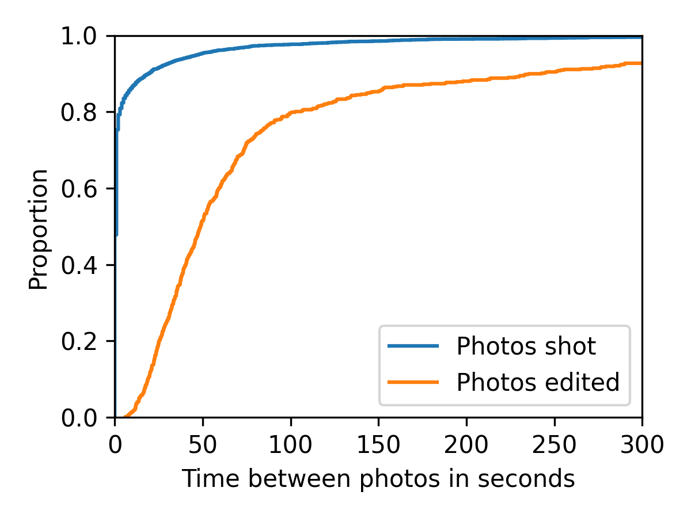

<details>
<summary>Details</summary>

```bash
analyze-photos \
    --raw-files-glob '*.CR3' \
    --edited-files-glob 'converted*/*.jpg' \
    --delta-plot 'delta_raw-vs-jpg.pdf' \
    /path/to/images/2025-09-20 /path/to/images/2025-10-*
```

In this example, I include my photos from several folders; one from September in 2025 and all from October.
Each of these folders is structured as follows:
```
/path/to/images/some-folder/
    converted_dt/
        image-001.jpg
        image-005.jpg
        image-007.jpg
        ...
    raw-file-001.CR3
    raw-file-002.CR3
    raw-file-003.CR3
    ...
```

So, to tell the analysis where to find my raw files and my edited files in each folder, I passed the arguments `--raw-files-glob` and `--edited-files-glob` accordingly.
Be careful to use single quotation marks for these arguments, otherwise your shell might evaluate the asterisks prematurely!
</details>

---

Compare session durations between each photo that you shot versus each photo that you edited.
A session is defined by a sequence of photos that have no break longer than 30 minutes between them.

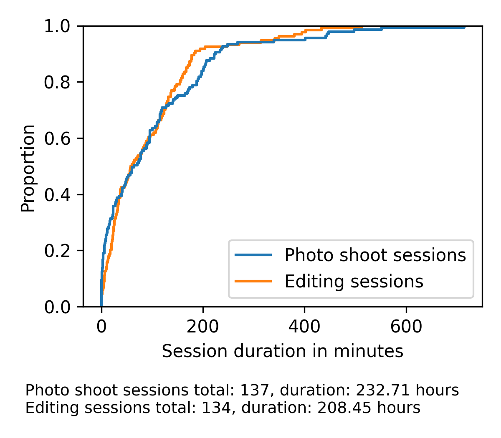

<details>
<summary>Details</summary>

```bash
analyze-photos \
    --raw-files-glob '*.CR3' \
    --edited-files-glob 'converted*/*.jpg' \
    --sessions-plot 'sessions_raw-vs-jpg.pdf' \
    /path/to/images/2025-*
```
</details>

---

Compare session durations between different folders for all edited photos in them:

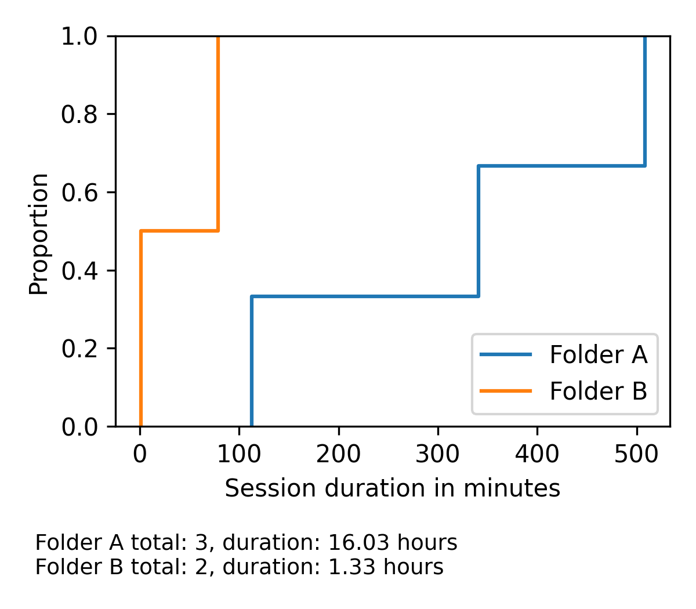

<details>
<summary>Details</summary>

```bash
analyze-photos \
    --compare-folders edited \
    --folder-comparison-labels 'Folder A' 'Folder B' \
    --edited-files-glob 'converted*/*.jpg' \
    --sessions-plot 'sessions_folders.pdf' \
    /path/to/images/{2025-09-20*,2025-09-27*}
```
</details>

---

Compare how many photos you shot (or edited) for each hour of the day on different occasions (i.e., in different folders):

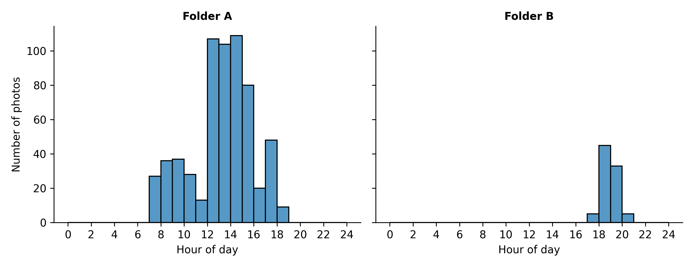

<details>
<summary>Details</summary>

```bash
analyze-photos \
    --compare-folders edited \
    --folder-comparison-labels 'Folder A' 'Folder B' \
    --edited-files-glob 'converted*/*.jpg' \
    --hour-of-day-plot 'hour-of-day_folders.pdf' \
    --cache-metadata \
    /path/to/images/{2025-09-20*,2025-09-27*}
```

Unlike the previous plots, which used file modification timestamps, this one uses EXIF metadata.
Reading metadata is slightly slower than reading file modification times for JPEGs, and it can be significantly slower for raw files.
The `--cache-metadata` option will write a JSON file to each provided folder named either `metadata_raw.json` or `metadata_edited.json`, accordingly.
If such a file already exists, metadata will be read from this file instead of reading all image files again.
</details>

---

Plot multiple metrics at once, such as focal lengths, exposure times, apertures, iso values, or light values:

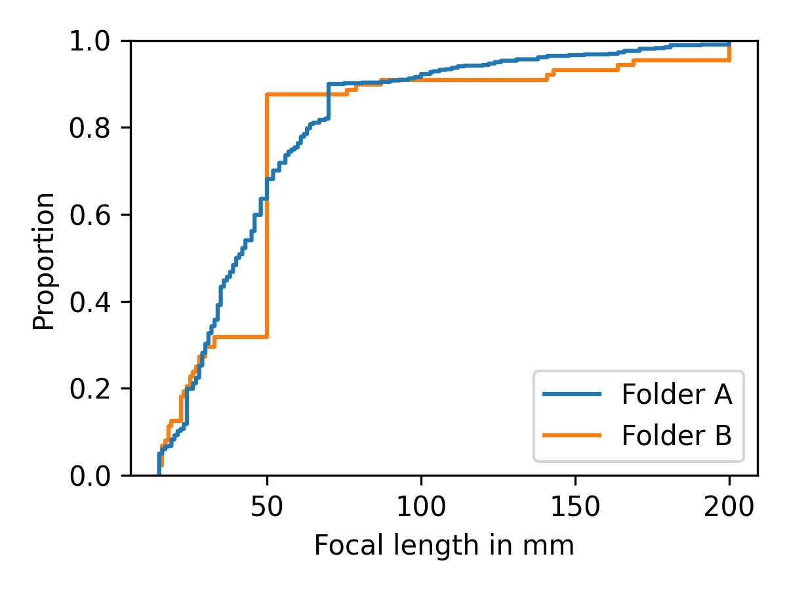
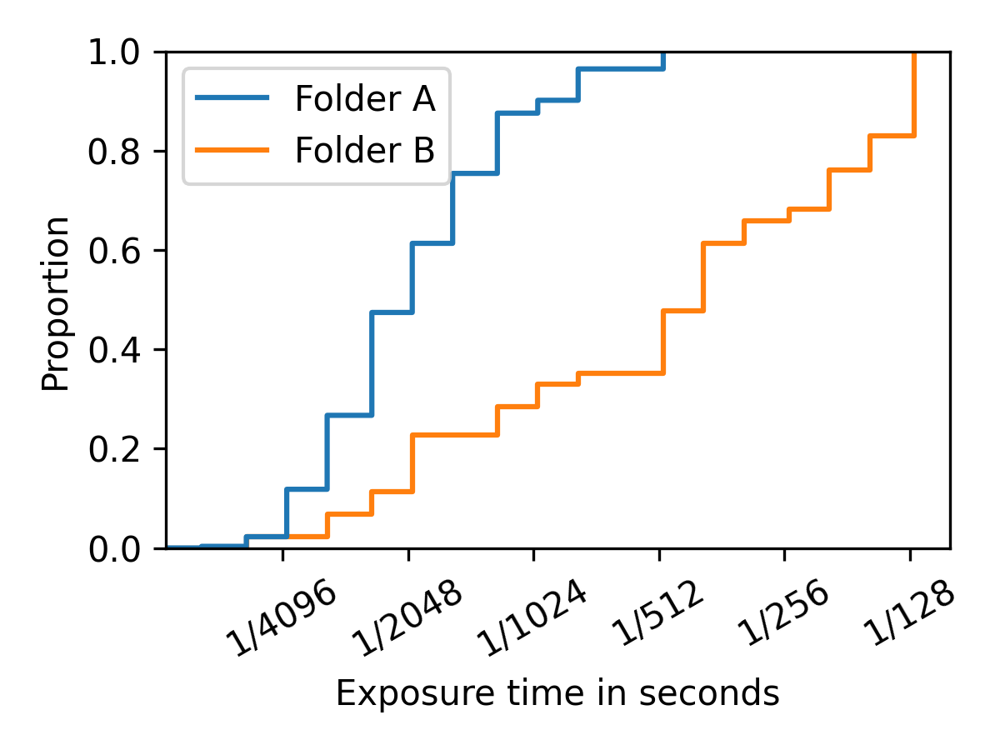
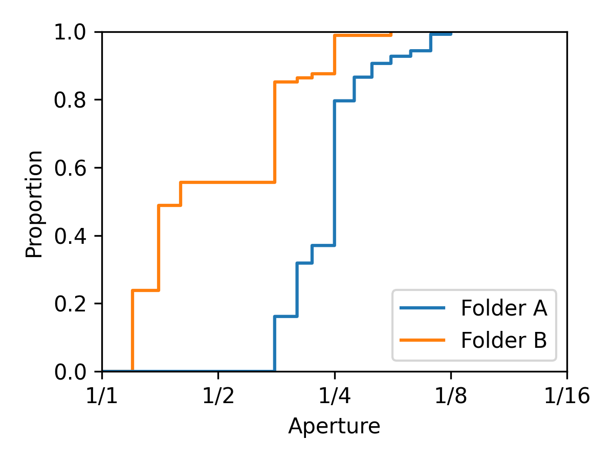
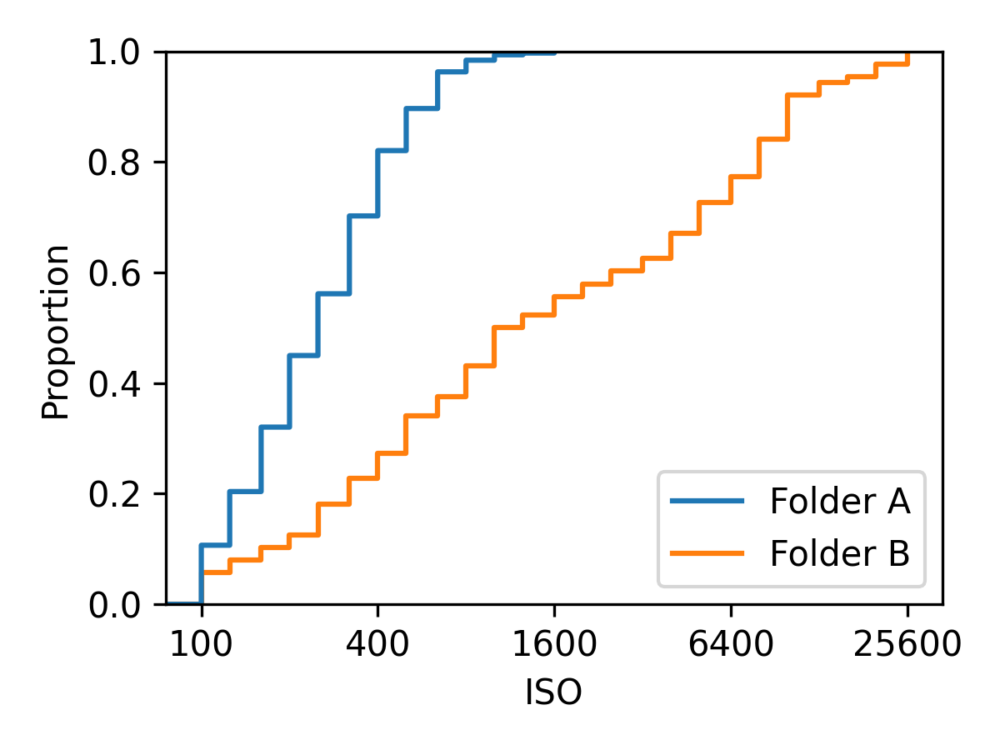
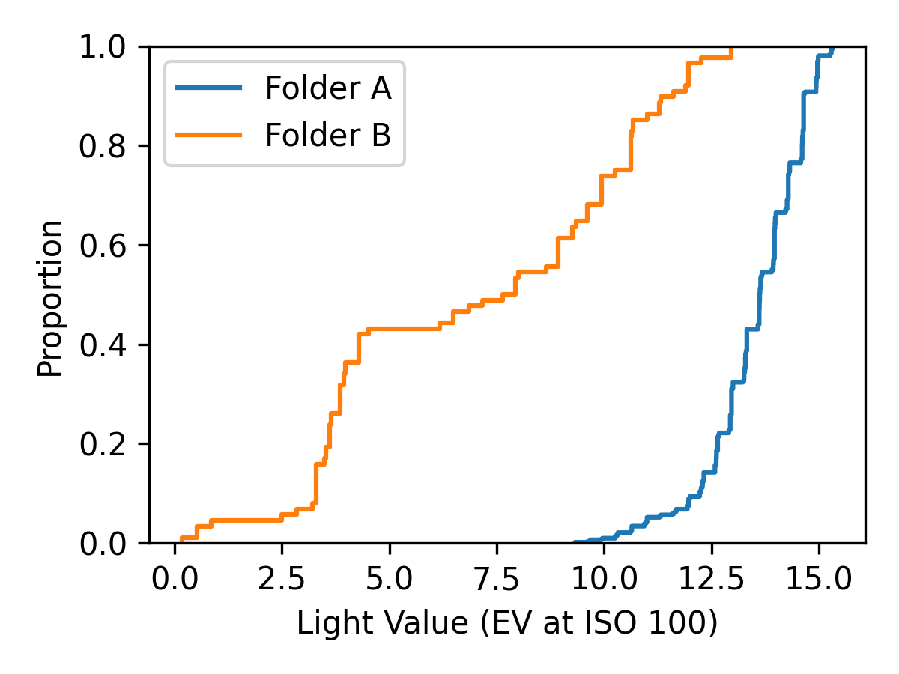

<details>
<summary>Details</summary>

```bash
analyze-photos \
    --compare-folders edited \
    --folder-comparison-labels 'Folder A' 'Folder B' \
    --edited-files-glob 'converted*/*.jpg' \
    --focal-lengths-plot 'focal-lengths_folders.pdf' \
    --exposure-times-plot 'exposure-times_folders.pdf' \
    --apertures-plot 'apertures_folders.pdf' \
    --isos-plot 'isos_folders.pdf' \
    --light-values-plot 'light-values_folders.pdf' \
    --cache-metadata \
    /path/to/images/{2025-09-20*,2025-09-27*}
```

For the definition of `LightValue`, check the [Exiftool documentation for composite tags](https://exiftool.org/TagNames/Composite.html).
According to them, LightValue is "similar to exposure value but normalized to ISO 100," so it should give us an idea how much light there was in the scenes we tried to capture (assuming we always tend to a 'standard' exposure).
</details>

---

Plot Lightroom editing parameters.
Many photographers still use proprietary editing software such as Adobe Lightroom, and by default Lightroom exports its editing parameters into the metadata of each exported image.
If you have folders with photos from different photographers, you can generate plots such as these:

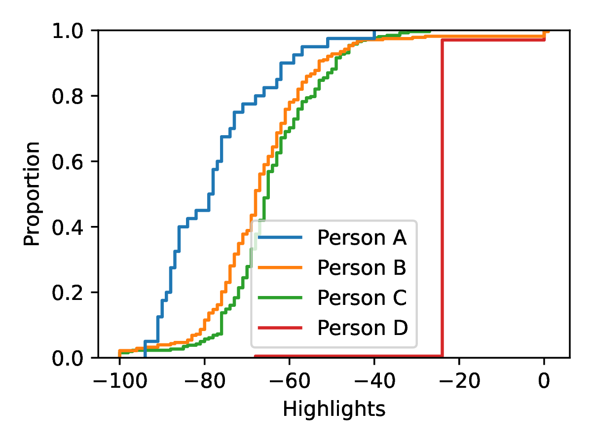
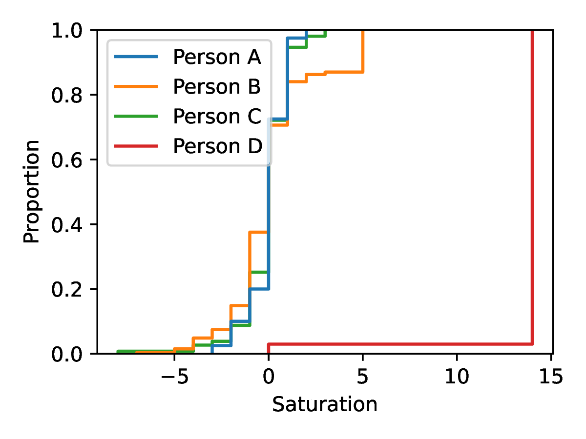

<details>
<summary>Details</summary>

```bash
analyze-photos \
    --cache-metadata \
    --folder-comparison-labels 'Person A' 'Person B' 'Person C' 'Person D' \
    --compare-folders edited \
    --use-nan-if-metadata-missing \
    --custom-metadata-plot \
        'lr_exposure.pdf' \
        'lr_contrast.pdf' \
        'lr_highlights.pdf' \
        'lr_shadows.pdf' \
        'lr_whites.pdf' \
        'lr_blacks.pdf' \
        'lr_texture.pdf' \
        'lr_clarity.pdf' \
        'lr_dehaze.pdf' \
        'lr_vibrance.pdf' \
        'lr_saturation.pdf' \
    --custom-metadata-plot-tag \
        'XMP:Exposure2012' \
        'XMP:Contrast2012' \
        'XMP:Highlights2012' \
        'XMP:Shadows2012' \
        'XMP:Whites2012' \
        'XMP:Blacks2012' \
        'XMP:Texture' \
        'XMP:Clarity2012' \
        'XMP:Dehaze' \
        'XMP:Vibrance' \
        'XMP:Saturation' \
    --custom-metadata-plot-axis-label \
        'Exposure' \
        'Contrast' \
        'Highlights' \
        'Shadows' \
        'Whites' \
        'Blacks' \
        'Texture' \
        'Clarity' \
        'Dehaze' \
        'Vibrance' \
        'Saturation' \
    --edited-files-glob '**/*.jpg' \
    /path/to/images/{PersonA,PersonB,PersonC,PersonD}
```
</details>
